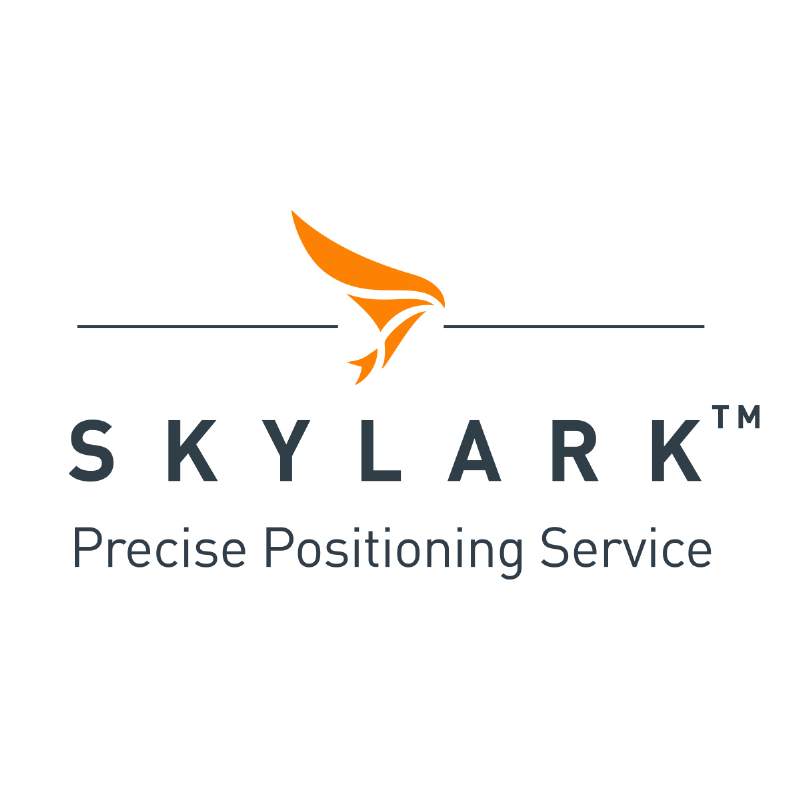

  
# Using Septentrio's Receiver and Swift Navigation's Skylark correction services for precise positioning

## GENERAL CONTEXT OF THIS GUIDE

GNSS (Global Navigation Satellite System) technology has changed the way we navigate and position ourselves, with applications in various industries including transportation, surveying and agriculture. However, atmospheric conditions and signal blockages can affect the accuracy of GNSS location information. 

GNSS corrections are used to mitigate these effects and improve the accuracy of position measurements. In recent years, there has been a growing demand for high-accuracy positioning, which has led to the evolution of GNSS correction mechanisms such as OSR, SSR or LBand delivery. Standardization is not yet established, making it challenging for users to access and use these corrections. 

To address this challenge, it is useful to create an ecosystem around GNSS corrections that is agnostic. This repository is part of a set of guides and documentation and explores a way of running Swift Navigation's Skylark corrections on your system quickly. Making it easy for users/integrators to evaluate and access these service. Platforms like Github enable documentation and the creation of demonstrators to allow users to try out different correction services with ease.

| <a href="https://github.com/septentrio-gnss/Septentrio_AgnosticCorrectionsProgram#set-up-guide-to-use-third-party-osr-and-ssr-correction-services-with-septentrios-receivers-for-precise-positioning">To access the GitHub homepage to which this guide belongs, click here</a>|
|---|

## AUTHORS
  
| Name | GitHub |
|------|--------|
| Iker Uranga | <a href="https://github.com/IkerUranga10">IkerUranga10</a>   |    

## MAINTAINER
  
| GitHub |
|--------|
| <a href="https://github.com/septentrio-users">septentrio-users</a>   |    

## DO YOU HAVE ANY QUESTIONS? CONTACT SEPTENTRIO SUPPORT TEAM

| <a href="https://web.septentrio.com/GH-SSN-support ">Septentrio Support Page</a>|
|---|

## SEPTENTRIO LINKS FOR USERS
 
| Contact                                                                          | Septentrio Home Page                                                        |
|----------------------------------------------------------------------------------|-----------------------------------------------------------------------------|
| <a href="https://web.septentrio.com/GH-SSN-contact ">Septentrio Contact Page</a> | <a href="https://web.septentrio.com/SKY-SSN-home">Septentrio Home Page</a> |

## DISCLAIMER
  
This set of guidelines consist of a several practical examplse to help Septentrio Module users and developers to integrate third party GNSS corrections. The guidelines are based on a concrete setup, which you may or may not use to follow the integration guidelines.

It is desirable to mention the disclaimer about that setup and the guides in general before starting reading this guide.
  
| <a href="https://github.com/septentrio-gnss/Septentrio_AgnosticCorrectionsProgram/tree/main/Receiver%20and%20Raspberry%20Setup#disclaimer">Click here to know more about the Setup in which these guides are based and general implementation documentation disclaimer</a> |
|---|

## TABLE OF CONTENTS

<!--ts-->

* [Introduction](#introduction)
* [Who is Swift Navigation?](#who-is-Swift-navigation)
* [What is Skylark?](#what-is-skylark)
* [Is the project Open Source?](#is-the-project-open-source)
* [Receiver and Raspberry Pi Setup](#receiver-and-raspberry-pi-setup)
* [str2str tool and RTKLIB installation](#str2str-tool-and-rtklib-installation)
    * [What are RTKLIB and str2str?](#what-are-rtklib-and-str2str)
    * [Tool installation](#tool-installation)
* [Running Skylark service and str2str tool](#running-skylark-service-and-str2str-tool)

<!--te-->

## INTRODUCTION

This repository consists in a how-to guide for the implementation of a system that uses a Raspberry Pi 4 Model B in combination with a Septentrio Module to obtain Swift Navigation's Skylark corrections for precise positioning. In this practical example case, mosaic-X5's Mosaic-Go Evaluation Kit is used, but any other Septentrio works in the same way if its connected with a USB cable. If you want to know more about or different modules and products you can visit us in: 

| <a href="https://web.septentrio.com/SKY-SSN-RX">Click here to the access to the all Septentrio GNSS Modules page.</a> |
|---|
   

Skylark is a wide area, cloud-based GNSS corrections service available in a suite of options—all delivering real-time, high-precision positioning.

| <a href="https://www.swiftnav.com/skylark">Click here to the navigate to Official Skylark Precise Positioning Service Web Page.</a> |
|---|
   

If you have any questions or feedback, please don't hesitate to reach out to us at <a href="https://web.septentrio.com/GH-SSN-support">Septentrio support page.</a>

## WHO IS SWIFT NAVIGATION?

    

Swift has the mission to build a safer and more efficient future by changing the way we navigate and understand every centimeter of our planet.

Swift delivers safe and precise positioning to keep the autonomous vehicles of today—and the future—in their lane. Swift continues to innovate with its ecosystem of precise positioning solutions for autonomous applications. They build on the foundation by offering a full suite of positioning solutions that are accurate, affordable and easily integrated while being reliable and secure for a variety of autonomous applications requiring precision positioning.

They value openness and participate in an open community, and when possible make our documentation, specifications, pricing and support available freely online. Swift products are designed and assembled in California, USA and benefit thousands of customers across the globe.

## What is SKYLARK?

    

Swift Navigation’s Skylark is a wide area, cloud-based GNSS corrections service that delivers real-time high-precision positioning to autonomous vehicles, automotive, mobile and mass-market applications. Skylark delivers seamless corrections to continents across the globe including the United States, Europe, South Korea, Japan and Australia. Built from the ground-up for autonomy at scale, Skylark enables lane-level positioning, fast convergence times and high integrity and availability required by mass-market automotive and autonomous applications. 

To know more about the service you can visit the following official web pages:

  
    
| <a href="https://www.swiftnav.com/skylark">Swift Navigation's official Skylark web page</a> |
|---|
    
| <a href="https://www.swiftnav.com/sites/default/files/skylark_product_summary.pdf">Skylark Product Summary document</a> |
|---|
   
| <a href="https://account.swiftnav.com/sign-up/septentrio">Click here to sign up to Skylark services now.</a> |
|---|
          

## IS THE PROJECT OPEN SOURCE?

This implementation guide for the Skylark correction services offered by Swift Navigation is open-source. That is, this repository does not contain any code created or modified by us, but is a guide to using the RTKLIB library or other techniques such as sharing the internet via USB cable from the Rapsberry Pi to the Septentrio receiver. Therefore, this guide could be modified thanks to the feedback of the users who use it, so you are welcome to leave us your opinion or suggestions for improvement.

## RECEIVER AND RASPBERRY PI SETUP

The implementation of this service is based and tested on a specific setup. This setup consists of two main elements and their wiring and peripherals. These elements are the Mosaic-Go Module evaluation kit and a Raspberry Pi 4 Model B. 

    
| <a href="https://github.com/septentrio-gnss/Septentrio_AgnosticCorrectionsProgram#set-up-guide-to-use-third-party-osr-and-ssr-corrections-with-septentrios-receivers-for-precise-positioning"> Click here to acces to our Set Up Guide to use Third Party OSR and SSR correction services with Septentrio's Receivers for precise positioning.</a> |
|---|
    

It is necessary to follow the instructions of the previous setup installation guide, to return to this point for the implementation of the Swift Navigation's Skylark corrections service.

## STR2STR TOOL AND RTKLIB INSTALLATION

Once the setup described above has been installed, the next step is to install a RTKLIB's tool called str2str, to be able to receive corrections from Skylark NTRIP Server/Caster to send them to the receiver and for to receive NMEA:GGA Messages from the receiver to send them to Skylark NTRIP Server/Caster.

### What are RTKLIB and str2str?

**RTKLIB:**

<a href="https://rtklib.com/">RTKLIB </a> is an open source program package for standard and precise positioning with GNSS (Global Navigation Satellite System). RTKLIB consists of a portable program library and several APs (application programs) utilizing the library. The Application Program we are going to use is str2str.

**str2str:**

<a href="https://manpages.debian.org/unstable/rtklib/str2str.1.en.html">str2str </a> is an Application Program that receives input data from a stream and divides and outputs them to one or multiple streams. The input stream can be serial, TCP client, TCP server, NTRIP client, or file. The output stream can also be serial, TCP client, TCP server, NTRIP server, or file.

This repository provides a solution for a specific case where the input stream is a corrections provider that uses NTRIP. In this case, you should have the information (host, stream, password, etc.) of the NTRIP connection of the Correction Service Provider.

### TOOL INSTALLATION

For the installation of the str2str tool, please following the next guide:

    
| <a href="https://github.com/septentrio-gnss/Septentrio_AgnosticCorrectionsProgram/tree/main/str2str#how-to-use-rtklibs-str2str-tool-to-receive-corrections-from-ntrip-server-and-send-them-to-septentrio-receiver"> How to use RTKLIB's str2str tool to receive corrections from NTRIP Server and send them to Septentrio receiver</a> |
|---|
    

Once the installation of the str2str tool has been made, there is only one last step is missing, which is the execution of the tool with your NTRIP credentials and serial port configuration. This steps are show in <a href="https://github.com/septentrio-gnss/SwiftCorrectionsWithSeptentrio#running-skylark-service-and-str2str-tool">next section</a>.

## Running Skylark service and str2str tool

Once the Receiver and Raspberry Pi setup and RTKLIB's str2str tool installation are done, the only step remaining is to execute the str2str tool as showed in the previous mentioned guide. Also, here is a generic example of the usage of str2str having NTRIP as an input source and Serial port as an output.

        

